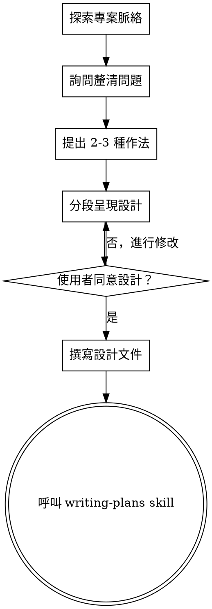

# 腦力激盪流程圖

```dot
digraph brainstorming {
    "探索專案脈絡" [shape=box];
    "詢問釐清問題" [shape=box];
    "提出 2-3 種作法" [shape=box];
    "分段呈現設計" [shape=box];
    "使用者同意設計？" [shape=diamond];
    "撰寫設計文件" [shape=box];
    "呼叫 writing-plans skill" [shape=doublecircle];

    "探索專案脈絡" -> "詢問釐清問題";
    "詢問釐清問題" -> "提出 2-3 種作法";
    "提出 2-3 種作法" -> "分段呈現設計";
    "分段呈現設計" -> "使用者同意設計？";
    "使用者同意設計？" -> "分段呈現設計" [label="否，進行修改"];
    "使用者同意設計？" -> "撰寫設計文件" [label="是"];
    "撰寫設計文件" -> "呼叫 writing-plans skill";
}
```

**最終狀態為呼叫 `writing-plans` skill。** 絕對不要呼叫 frontend-design、mcp-builder 或任何其他的實作 skill。你在腦力激盪後唯一能呼叫的 skill 就只有 `writing-plans`。
